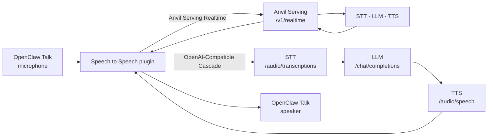

<h1 align="center">OpenClaw Speech to Speech</h1>

<p align="center">
  Bring your own voice stack to OpenClaw Talk—through Anvil Serving Realtime or directly through your own OpenAI-compatible endpoints.
</p>

<p align="center">
  <a href="https://github.com/fakoli/openclaw-speech-to-speech/actions/workflows/ci.yml"></a>
  <a href="https://github.com/fakoli/openclaw-speech-to-speech/releases/latest"></a>
  <a href="https://github.com/openclaw/openclaw"></a>
  <a href="https://nodejs.org/"></a>
  <a href="LICENSE"></a>
</p>

OpenClaw Speech to Speech is a self-hostable realtime voice plugin for
[OpenClaw Talk](https://github.com/openclaw/openclaw). It keeps the browser on
OpenClaw's authenticated Gateway and lets the operator choose where speech,
language, and synthesis run.

- **Anvil Serving Realtime** connects Talk to an OpenAI Realtime-compatible
  `/v1/realtime` service, including barge-in and OpenClaw tool continuation.
- **OpenAI-Compatible Cascade** connects Talk directly to separate STT, Chat
  Completions, and raw-PCM TTS endpoints—no Anvil Serving runtime required.

## At a glance

| Display name | Provider ID | Best for | Tool continuation |
| --- | --- | --- | --- |
| **Anvil Serving Realtime** | `anvil-serving` | Realtime streaming, Anvil Serving routing, and delegated OpenClaw work | Yes |
| **OpenAI-Compatible Cascade** | `openai-cascade` | A provider-neutral STT → LLM → TTS stack | No |

> **Compatibility:** `anvil` remains a supported alias for existing
> configurations. It is a legacy machine identifier only; the provider and
> product name are **Anvil Serving Realtime**.

## Quick start

### Requirements

- OpenClaw `2026.6.11` or newer
- A Node.js version supported by your OpenClaw installation (`22.19.0` is the
  minimum for the pinned compatibility baseline)
- Either an Anvil Serving Realtime endpoint or OpenAI-compatible STT, Chat
  Completions, and raw-PCM TTS endpoints

### Install the release

The npm package is not published yet, so install the signed-off package artifact
from GitHub Releases:

```bash
gh release download v0.2.0 \
  --repo fakoli/openclaw-speech-to-speech \
  --pattern 'fakoli-openclaw-speech-to-speech-0.2.0.tgz'
openclaw plugins install npm-pack:./fakoli-openclaw-speech-to-speech-0.2.0.tgz
```

You can also download the `.tgz` directly from
[GitHub Releases](https://github.com/fakoli/openclaw-speech-to-speech/releases).
Use the documentation bundled with the release you install.

Restart an unmanaged Gateway, then verify the live runtime—not only the cold
manifest:

```bash
openclaw gateway restart
openclaw plugins inspect speech-to-speech --runtime --json
```

A healthy inspection reports `status: "loaded"`, no diagnostics, and the
`anvil-serving` and `openai-cascade` realtime voice providers.

## How it works



Both paths use OpenClaw's Gateway relay. Audio never needs to pass through a
browser-owned provider connection or expose provider credentials to the
browser.

## Configure Anvil Serving Realtime

Use the canonical `anvil-serving` provider ID for new installations:

```jsonc
{
  "talk": {
    "realtime": {
      "provider": "anvil-serving",
      "transport": "gateway-relay",
      "brain": "agent-consult",
      "consultRouting": "force-agent-consult",
      "providers": {
        "anvil-serving": {
          "realtimeUrl": "ws://127.0.0.1:8765/v1/realtime"
        }
      }
    }
  }
}
```

Use `wss://` and an OpenClaw secret reference for remote deployments. Existing
`provider: "anvil"` configurations continue to resolve through the compatibility
alias.

## Configure an OpenAI-compatible cascade

Use `openai-cascade` when you operate the three services yourself and do not
want to run Anvil Serving:

```jsonc
{
  "talk": {
    "realtime": {
      "provider": "openai-cascade",
      "transport": "gateway-relay",
      "providers": {
        "openai-cascade": {
          "sttBaseUrl": "http://127.0.0.1:30010/v1",
          "sttModel": "your-stt-model",
          "llmBaseUrl": "http://127.0.0.1:8000/v1",
          "llmModel": "your-chat-model",
          "ttsBaseUrl": "http://127.0.0.1:30011/v1",
          "ttsModel": "your-tts-model",
          "ttsSampleRateHz": 24000,
          "voice": "your-voice-id"
        }
      }
    }
  }
}
```

The cascade sends 16 kHz mono PCM WAV to STT, retains bounded multi-turn text
context, requests non-streaming Chat Completions, and expects container-free
raw PCM16 with an explicit raw-audio `Content-Type` from TTS.

See the [configuration reference](docs/CONFIGURATION.md) for every setting,
secret handling, endpoint contracts, and the legacy `anvil` alias. The
[voice stack examples](docs/VOICE_STACKS.md) include benchmark-backed Parakeet,
Qwen3-ASR, Kokoro, and Apple Silicon starting points.

## Security and trust boundary

- The plugin adds no telemetry. It connects only to OpenClaw and the endpoints
  configured by the operator.
- Provider credentials support OpenClaw secret references and are never sent to
  the browser.
- Public endpoints require TLS; cleartext HTTP/WebSocket is limited to loopback,
  private, `.local`, or `.ts.net` hosts.
- Audio, text, JSON, error, and conversation buffers are bounded. Redirects,
  invalid JSON, and unsupported or ambiguous media types fail closed.
- Stock OpenClaw `2026.6.11+` needs no source patch. Historical overlays are
  excluded from the package.

Read the [security policy](SECURITY.md) before deployment and report suspected
vulnerabilities through GitHub Security Advisories—not a public issue.

## Documentation

| Document | Purpose |
| --- | --- |
| [Configuration](docs/CONFIGURATION.md) | Provider settings, secrets, endpoint contracts, and compatibility IDs |
| [Voice stack examples](docs/VOICE_STACKS.md) | Benchmark-backed STT/TTS starting points and complete cascade examples |
| [Troubleshooting](docs/TROUBLESHOOTING.md) | Runtime inspection, audio failures, TLS errors, and migration checks |
| [Security policy](SECURITY.md) | Supported versions, private reporting, and deployment guidance |
| [Contributing](CONTRIBUTING.md) | Local setup, test gates, and pull-request expectations |
| [Changelog](CHANGELOG.md) | Release history and unreleased changes |
| [Third-party notices](THIRD_PARTY_NOTICES.md) | Dependencies, licenses, and architectural inspiration |

## Compatibility

The plugin builds against and continuously tests the public realtime voice
provider contracts in stock OpenClaw `2026.6.11`. Newer OpenClaw releases may
raise their own Node.js requirement; follow the runtime requirement published
by the OpenClaw version you install.

The files in [`core-patches/`](core-patches/README.md) reproduce an older
Fakoli deployment with additional consult behavior. They are historical,
optional, and not included in the npm package.

## Inspiration

The direct cascade was inspired in part by
[Hugging Face Speech-to-Speech](https://github.com/huggingface/speech-to-speech)
and its modular VAD → STT → LLM → TTS architecture. The Realtime path grew out
of the voice pipeline in
[Anvil Serving](https://github.com/fakoli/anvil-serving) and OpenClaw's Gateway
relay provider model. This project is an independent OpenClaw plugin; see the
[third-party notices](THIRD_PARTY_NOTICES.md) for details.

## Development

```bash
npm ci
npm test
npm run test:docs
npm run build
npm run test:package
```

## License

Released under the [MIT License](LICENSE). Copyright © 2026 Sekou Doumbouya.
